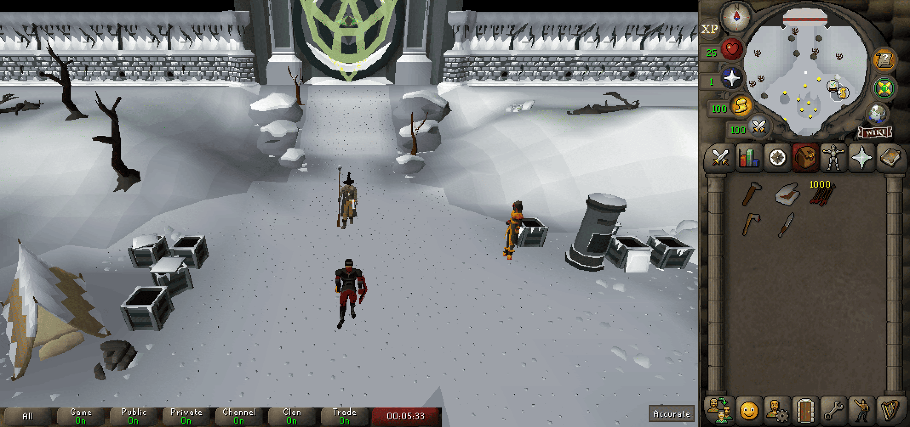

# Fixed Resizable Hybrid

**Fixed Resizable Hybrid** is a RuneLite plugin that reskins the "Resizable - Classic Layout" by styling it to match the aesthetics of Fixed Mode. It provides a faithful representation of the fixed mode interface, while preserving the benefits of resizable mode, such as a larger game viewport and minimizable chat.

---
## Using The Plugin
- Install and enable the plugin through the RuneLite community hub.
- Ensure your game client layout is **Resizable - Classic Layout**
  - Access this in the **Ingame Settings** > **Display Settings Tab** > **Game Client Layout**

### Features
- **Fixed Mode Aesthetic**:
  - Aligns the UI elements (e.g., minimap, inventory, orbs) to mimic the layout of Fixed Mode.
  - Replaces backgrounds and sprites to match the classic Fixed Mode design.
- **Automatic Aspect Ratio Resizing**
  - You can always just drag corner(s) of runelite to resize to whatever dimensions you'd like, but there are options for automatic scalings to specific aspect ratios (e.g. 16:9 or 21:9)
    - Useful for getting achieving specific dimensions for things like streaming or recording.
  - Automatically calculates dimensions based on the current client height or width (configurable).
- **Custom Background Image**:
  - In addition to the default "Tiled Stone" and "Solid Color" backgrounds, you can now use a custom image as a tiled background.
  - To use this feature, select "Tiled Custom Image" from the "Background Mode" dropdown in the plugin settings and provide the absolute file path to your desired image in the "Custom Image Path" field.

---
### Recommended Settings & Common Questions
#### How do I handle the gaps between the minimap and inventory?
Increasing the client's height will introduce vertical gaps, as the original fixed mode layout was never designed for taller windows. You have two main ways to handle this:

1.  **Embrace and Customize the Gaps**
    This plugin provides several options to fill the empty space for a customized look. In the plugin settings, you can choose a background filler, such as:
    - A **Tiled Stone** texture that matches the classic OSRS theme.
    - A **Tiled Custom Image** using a file path from your computer.
    - A simple **Solid Color**.

    You can also apply a **color tint** over any of these backgrounds for further customization.

2.  **Eliminate the Gaps with Stretched Mode**
    If you prefer no gaps at all, you can use the official **Stretched Mode** plugin to scale up the entire interface.
    - **To fill the gaps**, set the `Resizable Scaling` option in the Stretched Mode plugin to `100%`.
    - **To reduce blurriness** from scaling, enable the **GPU** plugin and set `UI Scaling` to `xBR`. This will smooth out the interface and minimize scaling artifacts.

#### How do I fix the inventory background?
- For the most authentic look, turn **off** the "Transparent Side Panel" option in the native OSRS settings (**Display Settings -> Interfaces -> Transparent Side Panel**). This will prevent the inventory background from changing and keep it consistent with fixed mode.

---
## Known Issues
- **Cutscenes**: Some newer quests have cutscenes that might interfere with the plugin. This is actively being addressed, as each quest has slightly different under-the-hood triggers that haven't all been caught.
- **Minimap Orbs**: In their default positions, the orbs around the minimap overlap with the minimap itself, and there are a few pixels in which you can click both the orb (e.g. run orb) and on the minimap with one click.
  - By default, the orbs are in the same position as seen in fixed mode. However, the "Orb Positioning" setting in this plugin's configuration will allow you to remedy this by moving the orbs slightly further away.
- **Plugin Conflicts**: Issues have been reported regarding concurrent use with the _chat resizing_ and _Watchdog_ plugins.
- **Resource Packs**: A few resource packs/interface styles aren't applied properly.
  - Most will work with this plugin, but the ones that change the dimensions of the inventory sprites have issues.

---
## Creating Custom Background Images
To use a custom background for the side panel, first select **Tiled Custom Image** from the `Background Mode` dropdown in the plugin settings. You must then provide the **absolute file path** to your image in the settings.

- **File Path**: The path must be an absolute path, not a relative one. For example: `C:\Users\YourUsername\Pictures\my_background.png`.
- **File Location**: Do **not** store your custom image inside any RuneLite folders (like `.runelite/external-plugins`). These folders can be overwritten by updates, which would delete your image. It's best to save it in a permanent location, such as your `Pictures` or `Documents` folder.
- **Image Width**: For best results, your image should be **249 pixels wide** to match the width of the side panel.
- **Tiling**: The plugin is designed to tile images vertically. If you use a small, seamless texture, it will repeat down the entire column to fill the space.
- **Fixed Images**: You can use a regular, non-tiling image, but it will be cut off if the client height is larger than the image height.

Here is the default stone texture used by the plugin. You can save and modify it to create your own version.

---
## Contact
Feel free to leave issues or feature requests to the [GitHub Project](https://github.com/Lapask/fixed-resizable-hybrid). Ill do my best to take a look at them.
You can also contact me via Discord (ID: Lapask#7584).